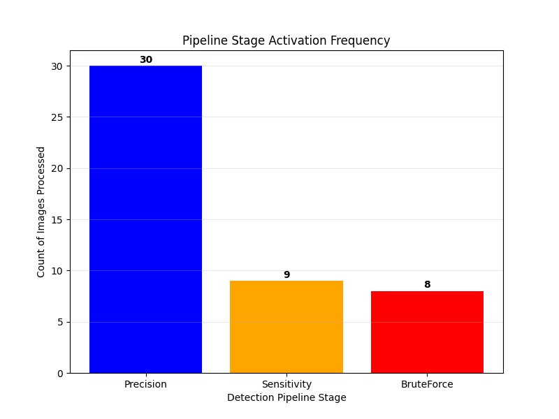

# FlatScan: Automation of Document Scanning with Perspective Correction

  

**FlatScan** is a computer vision application that automatically detects documents in images, corrects perspective distortion, and generates a clean "scanned" output. It is designed to handle challenging real-world conditions like shadows, complex backgrounds, and varying angles.

## 🖼️ Gallery

| Input Image | Detected Contour | Scanned Output |
| :---: | :---: | :---: |
|  |  |  |

*(Note: Replace the image paths above with actual filenames from your visual/scanned folders)*

## 🚀 Key Features

* **Cascading 3-Stage Pipeline:** Uses a smart fallback mechanism (Precision → Sensitivity → Brute Force) to ensure documents are detected even when lighting is poor or edges are broken.
* **Shadow Removal:** A custom post-processing algorithm divides out background shadows to create a clean, white paper look.
* **Intelligent Area Filtering:** Uses an "Incumbent Rule" to distinguish between the actual document and shadows or internal diagrams.
* **Performance:** Achieved an average IoU of **0.87** on a stress-test dataset of 40+ images.

## ⚙️ How It Works (The Algorithm)

The system does not rely on a single algorithm. It makes decisions dynamically:

1.  **Stage 1: Precision Pipeline (Canny Edge)**
    * **Goal:** Finds clean, sharp edges.
    * **Best for:** Standard documents on contrasting backgrounds.
    * **Technique:** Gaussian Blur (5x5) + Canny + Weak Dilation.

2.  **Stage 2: Sensitivity Pipeline (Adaptive Threshold)**
    * **Goal:** Finds faint edges and shadows.
    * **Best for:** "White-on-White" scenarios (e.g., Image 4).
    * **Technique:** Gaussian Blur (7x7) + Adaptive Threshold (Block 31, C=4) + Medium Dilation.

3.  **Stage 3: Brute Force Pipeline (Heavy Dilation)**
    * **Goal:** Connects broken lines.
    * **Best for:** Tables, Flowcharts, or dashed lines (e.g., Image 11).
    * **Technique:** Median Blur + Adaptive Threshold + Strong Dilation (3 iterations).

## 📊 Experimental Results

The algorithm was tested on a dataset including "stress test" images (crumpled receipts, texture traps, shadows).

* **Average IoU:** 0.8721
* **Success Rate:** 100% (All images > 0.60 IoU)

*Figure: Frequency of pipeline stages. While 'Precision' handles most cases, the fallback stages are critical for robustness.*

## 📂 Project Structure

* `src/`: Contains the core logic classes.
    * `preprocessor.py`: Implementation of the 3-stage pipeline.
    * `detector.py`: Contour filtering and approximation.
    * `warper.py`: 4-point perspective transform logic.
    * `postprocessor.py`: Shadow removal and binarization.
* `main.py`: The main script to run the application.

## 👥 Author

**Ahmet Fırat**
* Özyeğin University
* Computer Science Student
* Email: ahmet.firat@ozu.edu.tr